# Test des API Matrix avec Tchap

## Le principe    

Le logiciel de messagerie instantané Tchap est basé sur [Matrix](https://spec.matrix.org/latest/).
Le principe est de valider l'envoi de message vers un salon Tchap via l'[API Matrix](https://spec.matrix.org/latest/).

Dans le cas présent, nous utilisons l'appel à l'API Matrix via un shell unix. Mais il existe d'autres solutions qui permettent d'interagir avec un salon Tchap. 

Matrix recense différents [SDK](https://matrix.org/ecosystem/sdks/) incluant notamment les langages python et JS.

## Pré-requis

Vu sur le salon tchap [bot](https://tchap.gouv.fr/#/room/#BotsetIntgrationsTchapU2tHdMEN80D:agent.dinum.tchap.gouv.fr)

- choisir votre instance tchap et pour le MI, il s'agit de : matrix.agent.interieur.tchap.gouv.fr;
- choisir une adresse email précisant qu'il s'agit d'un bot (ex: cloudpinative.dso-bot@interieur.gouv.fr);
    - cette action n'est pas encore réalisée dans la mesure où nous sommes en phase de test sur un salon privé **test-tbt**
- définir un salon (ou ROOM) Tchap. Ici **test-tbt** dont l'identification est précisée dans les paramètres du salon.

## Actions

Voici les étapes :
- connexion pour obtenir un token de session;
- envoi d'un message;
- vérification sur le salon tchap **test-tbt** de l'arrivée des messages.

### connexion session

``` shell
#!/bin/bash

ROOM="!XXXXXXX:XXXXX.XXXXX.tchap.gouv.fr"
NOM_PRENOM="xxxxxxx.xxxxxx"
PASSWORD="xxxxxx"
DEVICE="ubuntu"
FILE_NAME="./token.txt"
TOKEN=""

if [ $# -eq 1 ]
  then
    MESSAGE=$1
else
    MESSAGE="veuillez saisir un message ..."
fi

if [ -f "$FILE_NAME" ]
then

 TOKEN=`cat $FILE_NAME`
 if [ -z "${TOKEN}" ]
 then
   echo "generer le token de session ...."
   TOKEN=`curl -sk -X POST "https://matrix.agent.interieur.tchap.gouv.fr/_matrix/client/r0/login" -H "Content-Type: application/json" -d \
"{\"type\": \"m.login.password\", \"user\": \"@${NOM_PRENOM}-interieur.gouv.fr:agent.interieur.tchap.gouv.fr\", \"password\": \"${PASSWORD}\", \"initial_device_display_name\": \"${DEVICE}\" }" | jq .access_token | sed 's,",,g'`
 fi
fi

echo ${TOKEN} > token.txt

```

> :warning: la conservation du token est nécessaire afin de ne pas générer de session *fantôme*. sous Tchap. 

### envoi d'un message

Le test consiste à envoyer un message de type texte (**_m.text_**). D'autres types sont possibles et sont référencés dans la documentation de l'[api matrix](https://spec.matrix.org/latest/client-server-api/#mroommessage-msgtypes)


``` shell

MESSAGE_PLAIN="${MESSAGE}"
MESSAGE_FORMATTED="&#9888;&#65039;<strong>${MESSAGE_PLAIN}<strong>"

function sendMessage() {

local MESSAGE_PLAIN=$1
local MESSAGE_FORMATTED=$2
local ROOM=$3
local TOKEN=$4

curl -sk -X POST -H "Content-Type: application/json" -d "{\"msgtype\":\"m.text\", \"body\":\"${MESSAGE_PLAIN}\",\"format\":\"org.matrix.custom.html\",\"formatted_body\":\"${MESSAGE_FORMATTED}\"}" "https://matrix.agent.interieur.tchap.gouv.fr/_matrix/client/r0/rooms/${ROOM}/send/m.room.message?access_token=${TOKEN}"

}

#curl -sk -X POST "https://matrix.agent.interieur.tchap.gouv.fr/_matrix/client/r0/logout?access_token=${TOKEN} 

```
     
### résultats

- Visualisation des tests effectués.


- :warning: En l'état l'échange s'effectue en https mais le chiffrement des messages tchap n'est pas effectif.

- Les messages représentés sous la forme **[canel2 dev] [🔴 Down] Request failed with status code 502** sont émis par la solution [uptime/kuma](https://github.com/louislam/uptime-kuma) qui inclue des possibilités de notification vers différents types de produit (Telegram, signal, Matrix,etc.)


- Exemple d'un message avec une alerte en gras et un [emoji warning](https://emojiguide.org/warning)
  - pour obtenir ce resultat :
    - utiliser l'attribut *formatted_body*;
    - utiliser l'attribut *format* avec la valeur `org.matrix.custom.html`;
    - la variable `MESSAGE_FORMATTED="&#9888;&#65039;<strong>${MESSAGE_PLAIN}<strong>"` contient le message encapsulé en html
      
---
### mode d'utilisation

```shell
./send-message-tchap.sh -m {message} [ -i ] [ -b ] -e {red|green|warn|info}
 -i : caractères en italique
 -b : caractères en gras
 -e : emoji
```

*Le paramètre `m` est obigatoire*. Vous pouvez intégrer du code html dans la valeur du paramètre m.

```
./send-message-tchap.sh -m "&#127945; coupe du monde 2023-09-08 20:15 France - NZ <br> aucun probleme de transport" -b -e green
```

---
### perspectives et cas d'usage 

**cas n°1** :
Nous sommes utilisateurs de l'offre DSO, nous disposons d'une console de supervision fonctionnelle et technique mais nous souhaitons être notifiés de l'état du service que nous soyons prestataires ou interne MI afin de mieux opérer le produit.

#### actions possibles

- créer un salon privé Tchap lors de la création du projet ([*test réalisé avec le package python matrix_client*](https://pypi.org/project/matrix-client/) pour créer le salon #test-tbt-room_alias);

- notifier l'état du service lors des phases de CI/CD;
- notifier de l'état du produits (ensemble des services) au moment du run;
- suppression (ou archivage) du salon privé lors de l'archivage du projet


**cas n°2** :
Dans le cadre du **CNCS JO** .... (*à compléter*)

```mermaid
sequenceDiagram

CMS->>Bus de Message: SEND /message
middleware->>+Bus de Message: 
Bus de Message-->>-middleware: GET message
middleware->>Tchap: 
middleware->>+Tchap: SEND /message  
Note right of Tchap: Ecoute des messages notifiés sur le salon 
Tchap-->>-middleware: Event /messages (room)
middleware->>Bus de Message: Send /messages
CMS->>Bus de Message: Get /message
```



---


## liens utiles
[Specifications Matrix](https://spec.matrix.org/latest/)

[Type de messages Matrix](https://spec.matrix.org/latest/client-server-api/#mroommessage-msgtypes)

[SDK](https://matrix.org/ecosystem/sdks/)

[Bots Matrix](https://www.matrix.org/bots/)

[GitHub Exemple Shell Matrix](https://github.com/fabianonline/matrix.sh)

[GitHub test sending message](https://gist.github.com/RickCogley/69f430d4418ae5498e8febab44d241c9)
